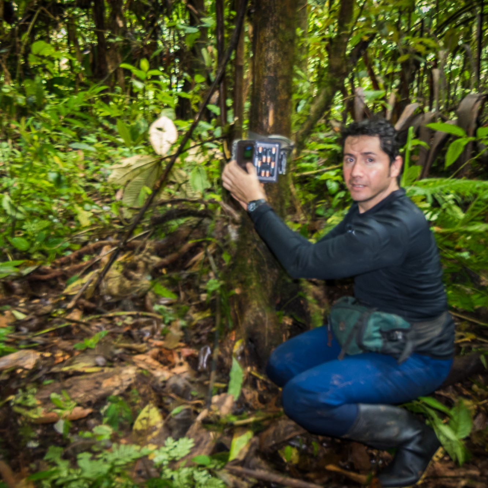
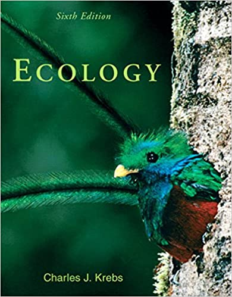
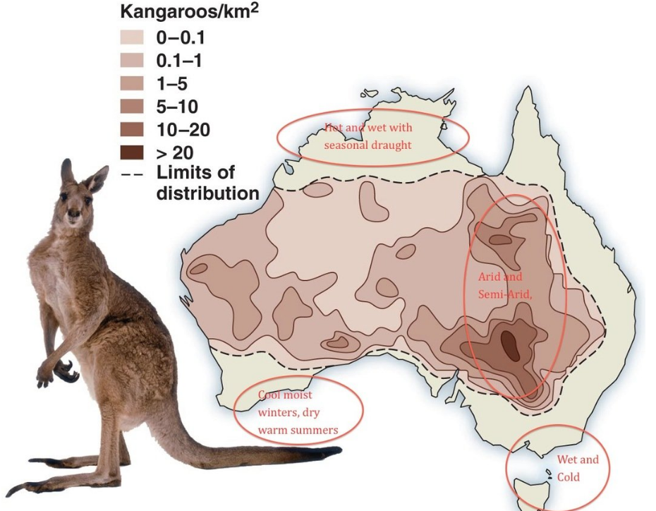
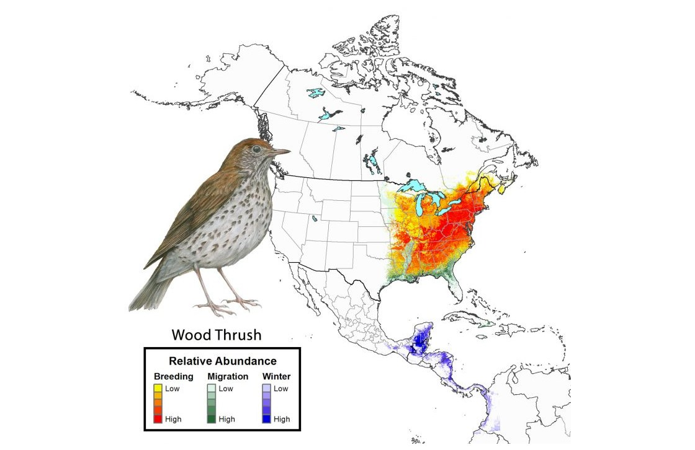
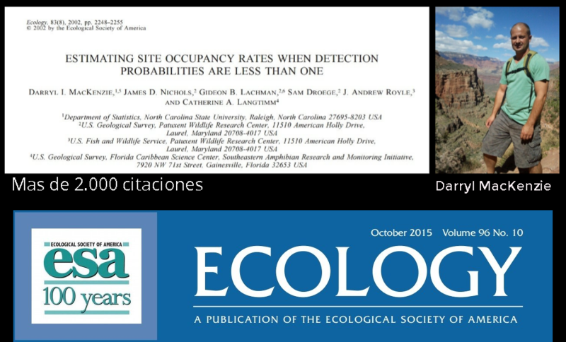
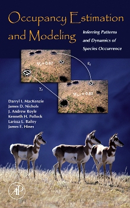
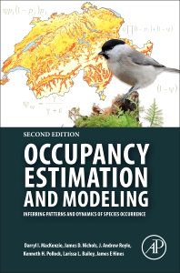

```{r xaringan-tile-view, echo=FALSE}
xaringanExtra::use_tile_view()
```

```{r xaringanExtra-freezeframe, echo=FALSE}
xaringanExtra::use_freezeframe()
```

```{r xaringanExtra-clipboard, echo=FALSE}
xaringanExtra::use_clipboard()
```

```{r broadcast, echo=FALSE}
xaringanExtra::use_broadcast()
```


class: title-slide, center, bottom

# `r rmarkdown::metadata$title`

## `r rmarkdown::metadata$subtitle`

### `r rmarkdown::metadata$author`

???

Welcome to the webinar on sharing on short notice

Where we'll show you how to get your teaching materials online with R Markdown.


```{r setup, include=FALSE}
options(htmltools.dir.version = FALSE)
library(fontawesome)
# library(icons)
xaringanExtra::use_share_again()
xaringanExtra::style_share_again(
  share_buttons = c("twitter", "linkedin", "facebook")
)
```


---
class: center, middle

# Gracias a

## Aída Otálora-Ardila


---
class: inverse, center, middle

# Get Started

---
class: inverse, center

# Diego J. Lizcano

[`r fontawesome::fa("github", fill = "black")`](https://github.com/dlizcano) [`r fontawesome::fa("twitter", fill = "black")`](https://twitter.com/dlizcano)   [`r fontawesome::fa("link", fill = "black")`](https://dlizcano.github.io)




--

Biólogo. Universidad de los Andes, Bogotá-Colombia.

--

Ph.D. University of Kent, Canterbury, UK.  
  
Ecology and conservation of large mammals (Andes). 


---

# En este mini taller...

Vamos a usar


Y muy recomendado usar 


---
class: center, top, inverse

# Ecology
### Charles Krebs


---

# Ecology: Study of interactions that determine **Distribution and Abundance**


.left-column[

]

.right-column[
### Distribution:

Where are they. 

### Abundance:

How many?.


]

--

Related to the problem of counting organisms!

--

---

# Contar animales no es un problema trivial...


Los animales se mueven

---

name: surprise
class: right, middle
background-image: url(https://media.giphy.com/media/5zoxhCaYbdVHoJkmpf/giphy.gif)
background-size: contain
background-position: left

.pull-right[
### Como contar animales: Un problema muy antiguo en Ecología
]

---

### Como Ecologo: El mapa de nuestros sueños



#### at some point, we had to count the kangaroos

---

# Contar Animales


#### Fácil para animales que son llamativos y que se agrupan.

---

# Contar Animales


#### No es tan fácil si no se agrupan. Capturar - Marcar - Recuperar. Distancia

---

# Contar Animales


#### Para algunas especies es engorroso, poco práctico y muy costoso

---

### Abundancia Relativa



#### Una variable indicadora del estado de la población

No sé cuántos hay, pero sí sé dónde hay más y dónde hay menos.

---

# Sin embargo...


#### Los animales se mueven y se esconden (camuflaje)

---
class: center
# El muestreo no es infalible


Los biólogos no somos superhéroes. ¡Cometemos errores!

#### Concepto de detectabilidad y detección imperfecta

---

# La detectabilidad depende de

--

## 1. Condiciones de muestreo (clima, tiempo).

--

## 2. La capacidad del observador (sensor).

--

## 3. 3. La biología de la especie que se está muestreando.

--

### Este error debe ser considerado cuidadosamente para evitar sesgos en las estimaciones de abundancia.

---

# Cómo se produce el error de detección (Guillera‐Arroita 2016)

see ppt 

##### ¡¡¡Es un error importante que debe ser considerado en el diseño muestral!!!

[por que considerarlo?](https://gguilleraresearch.wordpress.com/2017/02/28/accounting-for-imperfect-detection-in-the-modelling-of-species-distributions-range-dynamics-and-communities/)

---

# Mackenzie et al 2002, 2003 al rescate...


unnoticed...

---

# Libro y programa presence 2006

.left-column[

]

.right-column[

]


Mackenzie populariza la ocupación $(\psi)$ como un proxy de la abundancia teniendo en cuenta la detectabilidad $(p)$


---

# Libro y programa presence 2006

.left-column[

]

.right-column[
Una síntesis de enfoques basados en modelos para analizar datos de presencia-ausencia, considerando la detección imperfecta.
]


Mackenzie populariza la ocupación $(\psi)$ como un proxy de la abundancia teniendo en cuenta la detectabilidad $(p)$


---

## Allows you to set goals and to monitor them over time.


---
class: inverse, middle, center

## Occupancy 
# $$\psi$$

## Detection probability 

# $$p$$

### Occupancy is a reflection of other important population parameters such as density.


---


## 1.  $(\psi)$ is the proportion of the sampled area that is occupied by the species.


## 2.  By visiting the site several times I can be more sure that I detect the species when it is found in that place.


## 3.  **Repeated sampling** are key.


## $(\psi)$ It is influenced by environmental variables (**Covariables**) such as vegetation cover, altitude, precipitation, etc.


---

# This is what a data table with repeated sampling should look like


```{r eval=TRUE, echo=FALSE, warning=FALSE}
library(knitr)
muestreo<-c("visit1","visit2", "visit3", "visit4")
Sitio<-c("site1", "site2", "site3", "sitex")
mat<-matrix(c(1,0,1,0,
              0,0,1,0,
              0,0,0,0,
              1,0,0,0),nrow=4,ncol = 4)
colnames(mat)<-muestreo
rownames(mat)<-Sitio
kable(mat,booktabs=TRUE,longtable=TRUE)
```

---

# Example calculating $\psi$ and $p$

### Frequentist method (Maximum likelihood)

.pull-left[   
```{r eval=TRUE, echo=FALSE}
library(knitr)
muestreo<-c("v 1","v 2", "v 3", "v 4")
Sitio<-c("s 1", "s 2", "s 3", "s x")
mat<-matrix(c(1,0,1,0,
              0,0,1,0,
              0,0,0,0,
              1,0,0,0),nrow=4,ncol = 4)
colnames(mat)<-muestreo
rownames(mat)<-Sitio
kable(mat,booktabs=TRUE)
```
]

.pull-right[

| **Detection History**                  |
|----------------------------------------|
|  $H_{1} \psi$ × p1(1-p2)(1-p3)p4             |
|  $H_{2} \psi$ × (1-p2)(1-p2)(1-p3)(1-p4)p4 |
|  $H_{3} \psi$ × p1p2(1-p3)(1-p4)             |
|  $H_{4} \psi$ × (1-p2)(1-p2)(1-p3)(1-p4)p4 |

]


### Histories Combined in a Model:

$$
\begin{aligned}
L(\psi, p \mid H_{1},...,H_{x}) =  \prod_{i=1}^{x} Pr (H_{i})
\end{aligned}
$$
--

The model admits incorporating covariates to explain $\psi$ and $p$

--

---

# Same example calculating $\psi$ and $p$

### Bayesian method

.pull-left[   
```{r eval=TRUE, echo=FALSE}
library(knitr)
muestreo<-c("v 1","v 2", "v 3", "v 4")
Sitio<-c("s 1", "s 2", "s 3", "s x")
mat<-matrix(c(1,0,1,0,
              0,0,1,0,
              0,0,0,0,
              1,0,0,0),nrow=4,ncol = 4)
colnames(mat)<-muestreo
rownames(mat)<-Sitio
kable(mat,booktabs=TRUE)
```
]

.pull-right[

It is important to understand that there are two processes that can be modeled hierarchically

- The ecological process ($\psi$) follows a Bernoulli distribution.
- The observation model ($p$) follows a Bernoulli distribution.

The probability of observing the species given that it is present:

$p = Pr(y_{i}=1 \mid z_{i}=1)$

The Occupancy probability: $\psi =Pr(z_{i}=1)$

]

---

### A hierarchical (Bayesian) model


### Admits Covariates


---

## Which one should I use? The maximum likelihood or Bayesian?

.pull-left[ 
ML

- Package [unmarked](https://cran.r-project.org/web/packages/unmarked/index.html)
- In R
- Admits "automatic" model selection AIC
- Problems with many NAs
- Hesian problem. estimates ok.
- Difficulty from 1 to 10: 3 if you already know R.

]

Bayesian

.pull-right[
- BUGS or Stan language, called from R
- Model selection is not that easy, BIC is not suitable 
- You don't have as many problems with many NAs in the matrix
- Estimates are more accurate.
- Difficulty from 1 to 10: 7 if you already know R.

]

---
class: middle, center

# Going Deep


### Andy Royle (2008)

Advanced level book with lots of details, formulas, examples and code in R and BUGS language.

---

# Dragon-fly book (2015)

.pull-left[ 

]

.pull-right[ 
### More recent by [Marc Kery](http://store.elsevier.com/Marc-Kery/ELS_1059944/)

More than 700 pages clearly explaining where the theory comes from, in a tutorial style, starting with a basic level of R to advanced models and their implementation in R and the BUGS language.
]

---
background-image: url(img/baby-84626_1280.jpg)
background-size: contain

# Let's do it!


 
- R level? 
- Objects?, Vectors?
- DataFrame?
- Loops?
- Functions?

---

# Schedule


.left-column[

]

.right-column[

| Day       | Topic                                                                                                                                |
|-----------------|------------------------------------------------------|
| Tuesday 28 pm |  Remembering R                                                                                                                |
|           | [R as model tool](https://dlizcano.github.io/IntroOccuPresent/R_toModel_E.html)                                    |
| Wednesday 29 am | [Occupancy concept](https://dlizcano.github.io/IntroOccuPresent/modelOccuData_E.html)                        |
|           | Intro Occu Static model - [unmarked101](https://dlizcano.github.io/IntroOccuPresent/unmarked_101_E.html)                            |
| Wednesday 29 pm | Static Model in deep I- [Sim Machalilla](https://dlizcano.github.io/occu_book/)                                             |
|           | Static Model in deep II- [Data in unmarked](https://dlizcano.github.io/occu_book/unmarked.html) |
| Thursday 30 am | Questions. Real World Data - [Deer](https://github.com/dlizcano/Mazama_rufina)          |
|           | [More models](https://dlizcano.github.io/IntroOccuPresent/Otros_modelos_jerarquicos.html)                        |

]


---
class: bottom, center
background-image: url(img/children-593313_1280.jpg)
background-size: cover 


# Thanks!

Slides created via the R package [**xaringan**](https://github.com/yihui/xaringan).

Contact: Diego J. Lizcano
<a href="http://twitter.com/dlizcano"> `r fontawesome::fa("twitter", fill = "steelblue")`
<a href="http://github.com/dlizcano"> `r fontawesome::fa("github", fill = "black")`


---

```{r}
xfun::session_info('rmarkdown')
```


